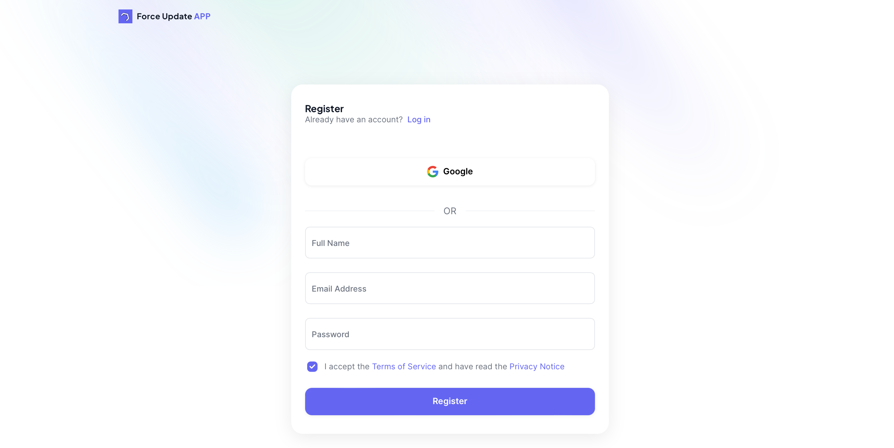

# Get started

## Set up an account

### Sign up

To get started, you need to sign up for an account on [Forceupdate Signup](https://forceupdate.app/auth/firebase/register). You can create a new account by providing your email and password or by using your Google account.

### Create your project

See the [Project Creation](project#creation) guide to create a new project.

## Get your API key

After creating a project, you'll be redirected to the dashboard. The tab "API Keys" will be selected by default. Now you can generate a new API key by clicking on the "Generate API Key" button. After generating the API key, you can copy it and use it in your app to integrate with ForceUpdate.

> This API key is used to authenticate your app with ForceUpdate on frontend. From this API key the forceupdate will know which project is making the request.

## Integrate with your app

Now that you have your API key, you can integrate it with your app. You can find the integration guide for different platforms in the sidebar.

Each platform has its own integration guide. You can choose the platform you are using and follow the guide to integrate ForceUpdate with your app.

Quick links:

- [API integration](api-integration)
- [React Native Integration](react-native-integration)
- [Flutter Integration](flutter-integration)
- [Android Integration](android-integration)
- [iOS Integration](ios-integration)
- [Web Integration](web-integration)

## Next steps

After integrating ForceUpdate with your app, you can start using the Dashboard to manage your app updates. You can check the [Forceupdate dashboard](https://api.forceupdate.app/docs) to see what you can do with the API.
