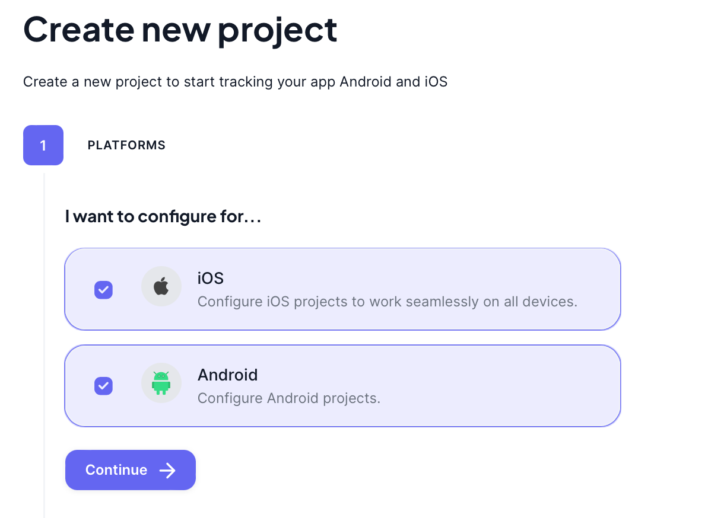

# Project

A project in Forceupdate is a way to group your app versions and manage them. Think it as your app in the Forceupdate platform.

In the project, you can:

- Manage your app versions
- Get your API key
- Configure your translations
- Give access to your team
- See the logs of your project
- See the analytics of your app (cooming soon)

## Creation

> [!NOTE]
> On free plan, you can create only one project. You can upgrade to a paid plan to create more projects. Check our [billing](billing) page for more

To create a new project, you need to click on the "Create Project" button on the top right corner of the dashboard.

or

Open the link: [https://dashboard.forceupdate.app/dashboard/projects/create](https://dashboard.forceupdate.app/dashboard/projects/create)

The project creation is basically divided into 3 steps:

### 1. Platform selection

You can select the platform you are using for your app. You can choose Android and/or IOS.

> If your app is available on both Android and iOS platforms, you can select both during the platform selection step.

### 2. Details

Here you are required to provide the "Project Name" and "Project Description".

> The "Project Name" is a name to use to identify your project, it can be anything and will not be show to the final users.
> The "Project Description" is a brief description of your project.

### 3. Store configurations

Here you can provide the store configurations for your app. You can provide the "Android Bundle ID" and "iOS Bundle ID" for your app. After that, you'll need to provide the "Android Store URL" and "iOS Store URL" for your app. This link are important to be correct, because the ForceUpdate will use them to redirect the user to the correct store to update the app.

> The "Android Bundle ID" and "iOS Bundle ID" are the unique identifiers for your app in the Google Play Store and Apple App Store, respectively.

### 4. Create

After providing all the required information, you can click on the "Create" button to create your project. You'll be redirect to project dashboard after the project creation.

## Next steps

After creating a project, you'll need to generate the API Key and create a new Version.

You can check the [Generating a API key](api-key) guide to get your API key and the [Version creation](version#creation) guide to create a new version for your app.
